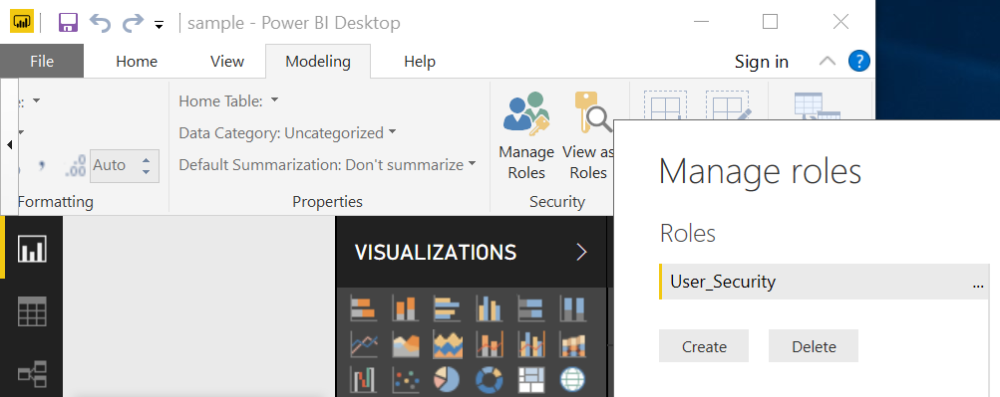
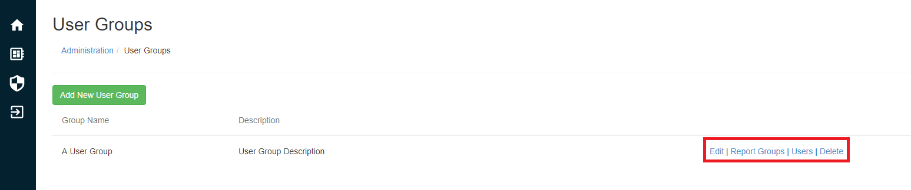

# Admin Guide 

###Getting Started
This guide will take you through all the required steps for providing secure reporting to your stakeholder. This includes:

1. Getting access to a Binokula Tenant
+ Building and publishing a report in Power BI Desktop
+ Providing access to reports in Binokula
+ Automating data refreshes

###Getting a Binokula Tenant
A Binokula Tenant is your dedicated area for publishing, hosting and managing access to your report content. Only organizations that wish to share and control access to reports need a Tenant. If you are expecting to just access reports in Binokula, you will need to be added as a User on a Tenant.

If your organization wishes to get a trial Tenant, please contact <sales@binokula.com>.

If you are expecting to already have access to reports in Binokula, you can enter your email address at <https://binokula.app> or contact the organization whose report content you wish to access.

###Building and Publishing Reports
####Building a Report without RLS

> * RLS - Row-Level Security ensures that users see only the data they are authorized to see.

Binokula uses Microsoft Power BI as its report building tool. For a report to be correctly published in Binokula, the report has to adhere to the following:

* Must have a security role called "User_Security" in the Power BI Model.

  

    Show "User_Security" example
  

  

####Building a Report with RLS
Building a report with RLS requires that the report adhere to the following:

* Must have a security role called "User_Security" in the Power BI Model.

  

    Show "User_Security" example
  

  

* Must have a DAX filter on the Entity to User Mapping List which uses the USERNAME() function.

  

    Show USERNAME() example
  

   filter")

* Cross filter direction should be set to Both for the relationship with Entity to User Mapping List
* Apply security filter in both directions should be ticked for the relationship with Entity to User Mapping List

  

    Show Cross Filter and Apply Security Fiter Both example
  

  

####Testing Power BI RLS
Once you have configured the RLS as shown above, you can test the security by impersonating a user. To do this:

1. Click "View as Roles" in Power BI Desktop;
+ Tick "Other User" and enter the test user's email address; and
+ Tick "User_Security" and click OK.

  

    Show "View as Roles" screen
  

  

You should now only see data that the test user should see.

####Publishing Power BI Reports
Once you have built and tested your Power BI report, the next step is to publish the report to your dedicated Tenant. This is done with the unique publisher account, details you would have received as part of requesting your Binokula Tenant. You can sign-in with the publisher account by clicking on "Sign in" in Power BI Desktop. If you are already signed in with a different account, click on the account name and select "Switch account". Once you are signed in, you can publish the report by:

1. Saving any changes;
+ Clicking on the "Publish" button on the Home menu; and 
+ Choosing "Binokula" as the destination before clicking "Select"

Note:
> * Save the report with a friendly name that you would want your users to see. Try to avoid names with abbreviations and version numbers like "test_fin_HL_V0.13".
> * Editing an existing report can be done by re-publishing the same report from Power BI Desktop. Select Yes when prompted to overwrite the dataset.
> * Another way to edit an existing report is by making changes on powerbi.com with your publisher account. Re-publishing from Power BI Desktop will override these changes.

####Reseting your Publisher Account Password
To reset your tenants Publisher Account password:

1. Navigate to the Administrator page
+ Go to Portal settings
+ Click the "Reset Publisher Account Password" link and confirm
+ Copy and use the strong temporary password provided to sign into your tenants Publisher Account via [Power BI](https://powerbi.microsoft.com)

Note:
> You will be prompt to change your password upon your initial sign in using the provided temporary password.

####Report for Mobile Viewing
Power BI Mobile is supported by Binokula. All you need to do is create the mobile view of a report in the Power BI Desktop file and publish it to your Tenant. Please see [Microsoft's Power BI Phone Report documentation](https://docs.microsoft.com/en-us/power-bi/desktop-create-phone-report) for more information on configuring phone layout on Power BI Desktop.

  

    Show Phone Layout option in Power BI Desktop
  

  

###Managing access to reports in Binokula
Any new reports published are by default not accessible to any users. Access to reports is controlled through Report Groups. To give yourself access to view a report, you will need to be an administrator and complete the following in Binokula:

1. Import the report definition into Binokula by clicking on the Refresh button in the reports administration page;
+ Create a new Report Group in the report group administration page;
+ Add the new report to the Report Group;
+ Add yourself as a user in the report group; and
+ Select the report in the Reports user page.

####Assigning more users and reports
The process is exactly the same as the previous steps, all you have to do is add more users. If it will be too time-consuming to add users by one-by-one, you can create a script to call the Binokula REST API to add users in bulk. Please see the Developer Guide for details on the REST API. If you need to expose more than one report to a specific audience, multiple reports can also be added to a Report Group through the Report Group administration page.

Note:
> * Currently communications to end users are managed by Tenant administrators. However, you can send a Forgot Password link to users directly in the User Management administration page.
> * Typical onboarding communication contains a link to the Binokula.app page with instructions to enter their email address and then click the Reset password link.

###Automating and scheduling the refresh of report data
Refreshing data for Binokula reports is the same as in any other Power BI report*. Any on-premise data used in the report needs to be supported by the Power BI On-Premise Data Gateway. The on-premise data gateway needs to be installed and configured with the credentials of your unique publisher account. Cloud data sources also need to be supported by the Power BI service. Additional information on Power BI's data refresh capabilities can be found here:

* [Data refresh in Power BI](https://docs.microsoft.com/en-us/power-bi/refresh-data)
* [Refresh Data Sources from Power BI Desktop](https://docs.microsoft.com/en-us/power-bi/refresh-data#power-bi-desktop-file)

*The Power BI Data Model still needs to have the "User_Security" role created in Power BI Desktop.

Once you have an on-premise data gateway configured, you can access [powerbi.com](https://powerbi.com) with your assigned publisher account and [configure the schedule refresh as per the Power BI Documentation](https://docs.microsoft.com/en-us/power-bi/refresh-scheduled-refresh).

###Managing Users
User Management is done through the [user management link](https://binokula.app/Admin/Users) in the admin portal. This interface will allow you to:

* [Add new users](https://binokula.app/Admin/AddUser)
* Delete users
* Enable/disable users
* Enable/disable admins
* Reset passwords

  

    User management functions
  

  

Note:
> * Users are automatically added when programmatically signed in with the [single-sign-on API](../developer-guide/#single-sign-on).
> * Bulk adding, deleting, enabling or disabling more than one user at a time can be achieved programmatically by calling the [User Management API](../developer-guide/#user-management).

###User Groups
User Group Management is done through [the user group link](https://binokula.app/Admin/UserGroups) in the admin portal. The User Group management page allows admins to:

* Create a new User Group
* Delete a new User Group
* Edit User Group Details
* Assign existing users to the group
* Assign the User Group to one or multiple report groups

  

    User group functions
  

  

####User Group Structure
Users within a User Group can be assigned to a Report Group. This function allows easier assignment and reassignment of multiple users to reports.

