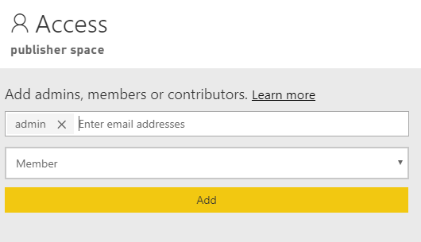
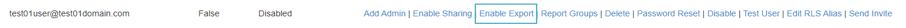
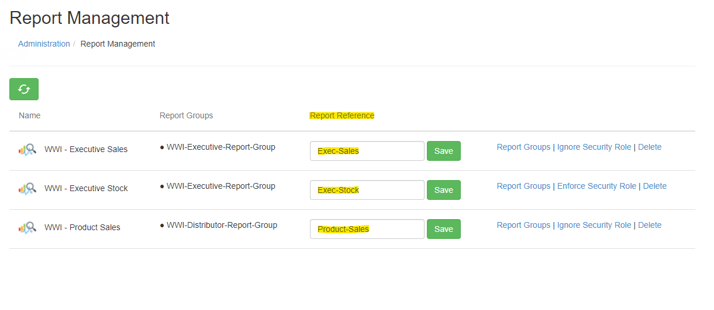
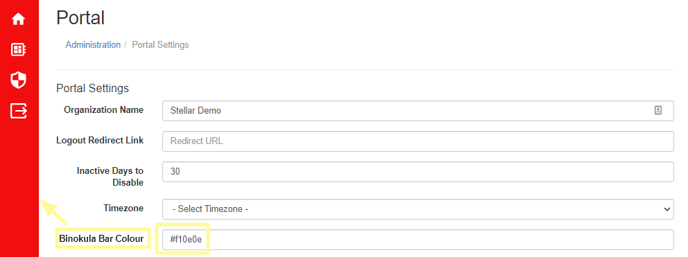

# Admin Guide 

###Getting Started
This guide will take you through all the required steps for providing secure reporting to your stakeholder. This includes:

1. Getting access to a Binokula Tenant
+ Building and publishing a report in Power BI Desktop
+ Providing access to reports in Binokula
+ Automating data refreshes

###Getting a Binokula Tenant
A Binokula Tenant is your dedicated area for publishing, hosting and managing access to your report content. Only organizations that wish to share and control access to reports need a Tenant. If you are expecting to just access reports in Binokula, you will need to be added as a User on a Tenant.

If your organization wishes to get a trial Tenant, please contact <sales@binokula.com>.

If you are expecting to already have access to reports in Binokula, you can enter your email address at <https://binokula.app> or contact the organization whose report content you wish to access.

###Building and Publishing Reports
####Building a Report without RLS
Binokula uses Microsoft Power BI as its report building tool. It is possible for a report to be published to Binokula without any RLS. For a report to be correctly published in Binokula without RLS, the report has to adhere to the following:

* The User Security configuration must be set to ignored. This can be done through [Report Management](../admin-guide/#managing-reports) under Binokula Admin page.

####Building a Report with RLS
> * RLS - Row-Level Security ensures that users see only the data they are authorized to see.

Building a report with RLS requires that the report adhere to the following:

* Must have a security role called "User_Security" in the Power BI Model.
 
  Show "User_Security" example
 

* Must have a DAX filter on the Entity to User Mapping List which uses the USERNAME() function.
* The table the DAX filter is on must contain the list of the users emails.
  Show USERNAME() example
   filter")

* Cross filter direction should be set to Both for the relationship with Entity to User Mapping List
* Apply security filter in both directions should be ticked for the relationship with Entity to User Mapping List
  Show Cross Filter and Apply Security Fiter Both example
  
 
####Testing Power BI RLS
Once you have configured the RLS as shown above, you can test the security by impersonating a user. To do this:

1. Click "View as Roles" in Power BI Desktop;
+ Tick "Other User" and enter the test user's email address; and
+ Tick "User_Security" and click OK.
 Show "View as Roles" screen
 
 
You should now only see data that the test user should see.

####Power BI Workspaces
Binokula supports multiple Power BI workspaces. This means any Power BI report can be published into any workspaces under your tenants publisher account. To ensure your report appears on Binokula, your tenants admin account must be a member of the workspace.

To include your tenants admin to your selected workspace:

1. Log into [powerbi.com](https://app.powerbi.com/) as your assigned publisher account.
* Navigate to your chosen workspace.
* At the top click "Access".
 
  Workspace access button
  

* In the Email search bar start typing admin. Your tenants admin account will have the same domain as your publisher account.
* In the drop down menu select "Member".
* Click Add.
  Add admin to workspace
  
 

* Reports within that workspace will now be available in Binokula after a Report Refresh in the Binokula Admin portal.

####Publishing Power BI Reports
Once you have built and tested your Power BI report, the next step is to publish the report to your dedicated Tenant. This is done with the unique publisher account, details you would have received as part of requesting your Binokula Tenant. You can sign-in with the publisher account by clicking on "Sign in" in Power BI Desktop. If you are already signed in with a different account, click on the account name and select "Switch account". Once you are signed in, you can publish the report by:

1. Saving any changes;
+ Clicking on the "Publish" button on the Home menu; and 
+ Choosing "Binokula" as the destination before clicking "Select"

Note:
> * Save the report with a friendly name that you would want your users to see. Try to avoid names with abbreviations and version numbers like "test_fin_HL_V0.13".
> * Editing an existing report can be done by re-publishing the same report from Power BI Desktop. Select Yes when prompted to overwrite the dataset.
> * Another way to edit an existing report is by making changes on powerbi.com with your publisher account. Re-publishing from Power BI Desktop will override these changes.

####Reseting your Publisher Account Password
To reset your tenants Publisher Account password:

1. Navigate to the Administrator page
+ Go to Portal settings
+ Click the "Reset Publisher Account Password" link and confirm
+ Copy and use the strong temporary password provided to sign into your tenants Publisher Account via [Power BI](https://powerbi.microsoft.com)

Note:
> You will be prompt to change your password upon your initial sign in using the provided temporary password.

####Report for Mobile Viewing
Power BI Mobile is supported by Binokula. All you need to do is create the mobile view of a report in the Power BI Desktop file and publish it to your Tenant. Please see [Microsoft's Power BI Phone Report documentation](https://docs.microsoft.com/en-us/power-bi/desktop-create-phone-report) for more information on configuring phone layout on Power BI Desktop.

  Show Phone Layout option in Power BI Desktop
  
 

###Managing Tenant details

####Assigning your organization name to your tenant
Your organization name will be used in automated emails sent out to users and other front facing features that labels your tenant.

1. Navigate to the Admin Page and click "Portal Settings"
+ Under the field "Organization Name" enter the name of your organization.
+ Click save.

###Managing access to reports in Binokula
Any new reports published are by default not accessible to any users. Access to reports is controlled through Report Groups. To give yourself access to view a report, you will need to be an administrator and complete the following in Binokula:

1. Import the report definition into Binokula by clicking on the Refresh button in the reports administration page;
+ Create a new Report Group in the report group administration page;
+ Add the new report to the Report Group;
+ Add yourself as a user in the report group; and
+ Select the report in the Reports user page.

####Assigning more users and reports
The process is exactly the same as the previous steps, all you have to do is add more users. If it will be too time-consuming to add users by one-by-one, you can create a script to call the Binokula REST API to add users in bulk. Please see the Developer Guide for details on the REST API. If you need to expose more than one report to a specific audience, multiple reports can also be added to a Report Group through the Report Group administration page.

Note:
> * Currently communications to end users are managed by Tenant administrators. However, you can send a Forgot Password link to users directly in the User Management administration page.
> * Typical onboarding communication contains a link to the Binokula.app page with instructions to enter their email address and then click the Reset password link.

###Automating and scheduling the refresh of report data
Refreshing data for Binokula reports is the same as in any other Power BI report*. Any on-premise data used in the report needs to be supported by the Power BI On-Premise Data Gateway. The on-premise data gateway needs to be installed and configured with the credentials of your unique publisher account. Cloud data sources also need to be supported by the Power BI service. Additional information on Power BI's data refresh capabilities can be found here:

* [Data refresh in Power BI](https://docs.microsoft.com/en-us/power-bi/refresh-data)
* [Refresh Data Sources from Power BI Desktop](https://docs.microsoft.com/en-us/power-bi/refresh-data#power-bi-desktop-file)

*The Power BI Data Model still needs to have the "User_Security" role created in Power BI Desktop.

Once you have an on-premise data gateway configured, you can access [powerbi.com](https://powerbi.com) with your assigned publisher account and [configure the schedule refresh as per the Power BI Documentation](https://docs.microsoft.com/en-us/power-bi/refresh-scheduled-refresh).

###Managing Users
User Management is done through the [user management link](https://binokula.app/Admin/Users) in the admin portal. This interface will allow you to:

* [Add new users](https://binokula.app/Admin/AddUser)
* Delete users
* Enable/disable users
* Enable/disable admins
* Enable/disable report sharing
* Reset passwords
* Test Users
  User management functions
  

Note:
> * Users are automatically added when programmatically signed in with the [single-sign-on API](../developer-guide/#single-sign-on).
> * Bulk adding, deleting, enabling or disabling more than one user at a time can be achieved programmatically by calling the [User Management API](../developer-guide/#user-management).

####Testing Users
It is possible to test users under your tenant. Admins can imitate users in their tenant through [user management](https://binokula.app/Admin/Users). 
Simply click the "Test User" link under the associated user and follow the instructions on the prompt that displays.

Testing Users

 

A message will prompt you to copy a link into a private or incognito browser to ensure you don't lose your current Binokula session.

####Report Export Permissions
The Export feature will be activated for a customer upon request.  Once activated, the customer’s Binokula Admin can enable the Export function for specific users as required.  Users can then export a report by: displaying the Reports screen, for a report selecting whether to export to a PDF or PowerPoint file, then clicking ‘Export Report’.    

Once ‘Export Report’ is clicked, a new tab is opened and the report is exported in the background.  Once the export processing is complete, a download link is displayed and the report can be downloaded using the normal browser download function. 

####Report Sharing Permissions
Admins have the ability to grant users the ability to share their reports via a link. This shared link is secured and only people who have the generated link can view the report. The shared report will be have the same view as the user who shared the link. When the report sharing is disabled for a user, all existing shared links for each report will become invalid.

###Managing Reports
Report Management is done through the [report management link](https://binokula.app/Admin/Reports) in the admin portal. This interface will allow you to:

* Delete a Report. 
    * Note: If the report still exists within the Power BI Workspace the report will reappear within the next refresh.

* Enforce/Ignore User Security Roles on the selected report

####Report Reference

Ask admin to enable report reference feature.
Go to https://binokula.app/Admin/Reports

**Consume Report Reference:**

* [External Access Using Report Reference](../developer-guide/#redirect-to-binokula-external-access-using-report-reference)   

* [Get Embed Token Using Report Reference](../developer-guide/#get-embed-token-using-report-reference)   
 

###User Groups
User Group Management is done through [the user group link](https://binokula.app/Admin/UserGroups) in the admin portal. The User Group management page allows admins to:

* Create a new User Group
* Delete a new User Group
* Edit User Group Details
* Assign existing users to the group
* Assign the User Group to one or multiple report groups
  User group functions
 
 
####User Group Structure
Users within a User Group can be assigned to a Report Group. This function allows easier assignment and reassignment of multiple users to reports.

###RLS Aliasing
Admins have the option of enabling username aliasing to their users. Users can share the same alias. By enabling RLS Aliasing the RLS then uses the users alias as the filter on the report. Your Reports filtering must be mapped to the aliasing of your choice. The RLS Aliasing and enablement can be found on the User Management page.

####Editing users RLS Alias
1. Navigate to the Admin page then select "User Management"
+ Find the user you want to edit their alias for
+ Click "Edit RLS Alias" on the users row. This will take you to the Edit Page.
+ Fill in your desired alias into the form
+ Click the "Save" button to save your changes

####Enabling/Disabling one users RLS Alias
1. Navigate to the Admin page then select "User Management"
+ Find the user you want to enable/disable their alias for
+ Click "Edit RLS Alias" on the users row. This will take you to the Edit Page.
+ Check the checkbox to enable their alias or uncheck to disable alias
+ Click the "Save" button to save your changes

####Custom Emails
It is possible to customize invitation emails to your users. An example of a customized email can be found below.

1. Navigate to the Admin page then select "Portal Settings".
+ Click on to the "Customize Email Invite (Advanced)" link.
+ Fill in the form.
    1. Use Binokula Logo - Include Binokula branding within your custom email.
    + Header - The title of your custom email.
    + Body - Your main message of the custom email.
    + Enable Custom Email checkbox - Use your custom email. Default email is used if unticked.
+ Click Save.

 Custom email example
 

####Custom Binokula Bar Colour
It is possible to customize the Binokula Bar Colour.

Custom Binokula Bar Colour example

####Edit User Name
1. Admin status and menu option only
2. Integrated with existing User Name options in the User Management menu
+ Process= Click 'Edit' to bring up a text update box that overwrites directly over the existing email for you to update and save.
3. Provides you with a quick opportunity to update team email addresses, whilst maintaining all user group and report group settings and report access.

####Portal Branding
1. Admin status and menu option only
2. The new Portal Branding page is included on the Administration menu
   + The ability to self-manage logo updates is now included.
   + The Binokula Bar colour update has been moved here from Portal Settings as this is branding related.
3. Provides you with the opportunity to update branding content as you see fit.

