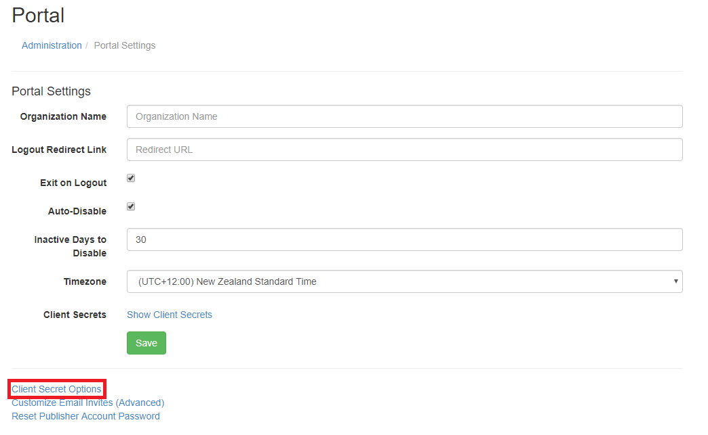
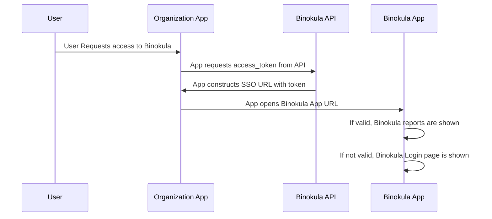

# Developer Guide 

###Introduction
The Binokula API provides external applications the ability to access, edit or add objects related to the Binokula application. Current end-points focus on user management and access to reports. All API calls are secured with SSL, tenant names and API Keys (client_secret). If you need access to your client_secret, please contact <support@binokula.app>.

###Client Secret
Your Client is used to access Binokula's API endpoints. Your tenants Client Secret can be accessed by an Admin account. To find your tenants Client Secret:

1. Sign into Binokula with an Admin account
+ Navigate to the Administrator page
+ Go to Portal settings
+ Find the label Client Secret and click "Show Client Secret"

From there you can copy the Client Secret and start using Binokula APIs!

####Managing Client Secrets
It is possible to have multiple client secrets. If you feel that a current client secret has been comprimised then you can delete it and generate new ones. 

To manage your client secrets:

1. Navigate to the Administrator page
+ Go to Portal Settings
+ Click "Client Secret Options"

 
 
+ From there you can delete client secrets and generate new ones by clicking the "Generate New Client Secret" button

Note: Each tenant must have atleast 1 client secret

###Single-Sign On
####Overview
Single-Sign On (SSO) enables external applications to give users access to Binokula without the need for them to enter their Binokula password. Access to Binokula is gained with the combination of a user's email address and a securely generated access token. The access token is valid for one hour and can be refreshed using the API. Binokula will check if the users email is registered as a system user and if the access token is valid before granting access to the application. If authentication fails, a redirect to the Binokula login page will be executed. Only one user token can be active at any given time.




####Endpoints
#####Issue/Renew User Access Token
**URL:** <https://api.binokula.app/api/Token>

**HTTP Verb:** GET

**Headers:**

* client_secret

**Parameters:**

* email
* tenant
* code
    * This is a function key provided to the customer to access this endpoint
* existingusersonly **(optional)**
    * Boolean
    * Default set to "false". When "true" a valid token is only generated for existing users. Can be used to stop users from being auto-created.
* alias **(optional)**
    * This is used to assign the user an alias upon access token creation
* aliasEnable **(optional)**
    * Boolean
    * Default set to "false". When "true" the alias assigned to the user will be used in the reports RLS filtering.
    * Note: If the Alias is enabled but no alias is assigned to the user then Binokula will use the users email as the RLS filtering by default 

Response:

Status: 200 OK
```json
{
    "email": "example@example.com",
    "access_token": "FbyIcycqczD6sT519Clgo2iNoW3wxXupT2uxRbUrGO8=",
    "expiry_date": "2018-04-26T03:08:03.893495+00:00"
}
```

RLS Aliasing Notes:

* The RLS Alias optional parameters made in the request of the access token are applied when the access token is used
* If the access token has not been used before it has expired then the RLS Alias parameters in will not be saved to the user

#####(Redirect to) Binokula External Access
**URL:** <https://binokula.app/Account/ExternalAccess>

**Parameters:**

* email
* access_token
* tenant
* reportId **(optional)**
    * To redirect straight to the desired report
* allowNewUsers (True or False, where True allow creating new user)

**Response:**

* Status: 200 OK
* Redirects to users Binokula homepage

#####(Redirect to) Binokula External Access using report reference
**URL:** <https://binokula.app/Account/ExternalAccessReportRef>

**Parameters:**

* email
* access_token
* tenant
* reportRef **(optional)**
    * To redirect straight to the desired report
* allowNewUsers (True or False, where True allow creating new user)

**Response:**

* Status: 200 OK
* Redirects to users Binokula homepage

**Note:** Credentials are URL encoded

**Setup Report Reference:**

* Go to [Report Reference](../admin-guide/#report-reference)   

###User Management
####Overview
The User Management API enables external applications to register, delete, enable or disable users to their Binokula tenant. This register endpoint creates a user with an email and generates a secure password for the newly created user. The password is not known to the external application nor the registered user. To access this endpoint the external application must supply the API a valid client secret key along with tenant name.

####Endpoints
#####Register User
**URL:** <https://api.binokula.app/api/User>

**HTTP Verb:** PUT

**Headers:**

* client_secret

**Parameters:**

* email
* tenant
* code
    * This is a function key provided to the customer to access this endpoint

**Response:**

* Status: 200 OK

```json
{
    "message": "\"Successfully registered example@example.com\""
}
```

#####Delete User
**URL:** <https://api.binokula.app/api/User>

**HTTP Verb:** Delete

**Headers:**

* client_secret

**Parameters:**

* email
* tenant
* code
    * This is a function key provided to the customer to access this endpoint

**Response:**

* Status: 200 OK

```json
{
    "message": "\"Successfully removed example@example.com\""
}
```

#####Enable/Disable User
**URL:** <https://api.binokula.app/api/UserStatus>

**HTTP Verb:** Post

**Headers:**

* client_secret

**Parameters:**

* email
* tenant
* status ("true" - enables user/"false" - disables user)
* code
    * This is a function key provided to the customer to access this endpoint

**Response:**

* Status: 200 OK

```json
{
    "message": "\"User Status set to true/false\""
}
```

#####User Group List
**URL:** <https://api.binokula.app/api/UserGroup/List>

**HTTP Verb:** Get

**Headers:**

* client_secret

**Parameters:**

* email **(optional)**
* group **(optional)**
* tenant
* code
    * This is a function key provided to the customer to access this endpoint

**Response:**

* Status: 200 OK

#####User Activity List
This endpoint gets the top 1000 records by descending order by default. Supply the row ID in the query parameter to get the subsequent 1000 records starting at that row.

**URL:** <https://api.binokula.app/api/EventActivity/List>

**HTTP Verb:** Get

**Headers:**

* client_secret

**Parameters:**

* email **(optional)**
* event **(optional)**
    * user_delete
    * user_add
    * report_view
    * portal_login
    * sso_login
    * forgot_pwd_invalid
    * disable_user
    * forgot_pwd_valid
* start_time **(optional)**
    * Any datetime string format
    * E.g. MM/dd/yyyy hh:mm tt
* end_time **(optional)**
    * Any datetime string format
    * E.g. MM/dd/yyyy hh:mm tt
* id **(optional)**
* tenant
* code
    * This is a function key provided to the customer to access this endpoint

**Response:**

* Status: 200 OK

```json
[{
    "timestamp": "2019-03-07T02:04:26.2046466",
    "user": "test@email.com",
    "eventActivity": "report_view",
    "reportGUID": "2a9cfe63-a909-4791-845a-6500f0fac8aa"
}, {
    "timestamp": "2019-03-07T02:04:16.8408495",
    "user": "test@email.com",
    "eventActivity": "portal_login",
    "reportGUID": null
}, {
    "timestamp": "2019-03-07T00:13:37.3125127",
    "user": "test@email.com",
    "eventActivity": "user_add",
    "reportGUID": null
}]
```

###Binokula Generated Report Properties API
####Overview
The Binokula API can provide you with the necessary tokens and credentials to embed Binokula generated reports on your own web page. In order to embed Binokula generated to your own webpage, you must use the [Power BI JavaScript API](https://github.com/Microsoft/PowerBI-JavaScript/wiki/Embedding-Basics#application-owns-the-data) and use Binokula generated embed tokens to do so. To embed a Binokula generated report you will need:

* Report ID
* Dataset Id
* Embed Token

To get the above you will need to use the Binokula API. 

Note: Binokula is not responsible for the security implemented on your independent web page. Developers must ensure that reports they are embedding are only visible to their intended users.

####Endpoints

#####Get Report List
**URL:** <https://api.binokula.app/api/Report/List>

**HTTP Verb:** Get

**Headers:**

* client_secret

**Parameters:**

* email **(optional)**
    * Default: Returns all reports 
* tenant
* code
    * This is a function key provided to the customer to access this endpoint

**Response:**

* Status: 200 OK

```json
[
    {
        "id": "xxxxxxxx-xxxx-xxxx-xxxx-xxxxxxxx",
        "name": "Sample Report 01",
        "webUrl": "https://app.powerbi.com/groups/groupsID/reports/reportid",
        "embedUrl": "https://app.powerbi.com/reportEmbed?reportId=...&groupId=....&config=...",
        "datasetId": "xxxxxxxx-xxxx-xxxx-xxxx-xxxxxxxx"
    },
   {
        "id": "xxxxxxxx-xxxx-xxxx-xxxx-xxxxxxxx",
        "name": "Sample Report 02",
        "webUrl": "https://app.powerbi.com/groups/groupsID/reports/reportid",
        "embedUrl": "https://app.powerbi.com/reportEmbed?reportId=...&groupId=....&config=...",
        "datasetId": "xxxxxxxx-xxxx-xxxx-xxxx-xxxxxxxx"
    },
    {
        "id": "xxxxxxxx-xxxx-xxxx-xxxx-xxxxxxxx",
        "name": "Sample Report 03",
        "webUrl": "https://app.powerbi.com/groups/groupsID/reports/reportid",
        "embedUrl": "https://app.powerbi.com/reportEmbed?reportId=...&groupId=....&config=...",
        "datasetId": "xxxxxxxx-xxxx-xxxx-xxxx-xxxxxxxx"
    },
]
```

#####Get Embed Token
**URL:** <https://api.binokula.app/api/Report/EmbedToken>

**HTTP Verb:** Get

**Headers:**

* client_secret

**Parameters:**

* email
* tenant
* reportId
* datasetId
* code
    * This is a function key provided to the customer to access this endpoint

**Response:**

* Status: 200 OK

```json
{
    "token": "H4...rf",
    "tokenId": "xxxxxxxx-xxxx-xxxx-xxxx-xxxxxxxx",
    "expiration": "2019-03-05T03:05:36Z",
    "id": "xxxxxxxx-xxxx-xxxx-xxxx-xxxxxxxx",
    "name": "Sample Report 03",
    "webUrl": "https://app.powerbi.com/groups/groupsID/reports/reportid",
    "embedUrl": "https://app.powerbi.com/reportEmbed?reportId=...&groupId=....&config=...",
    "datasetId": "xxxxxxxx-xxxx-xxxx-xxxx-xxxxxxxx"
}
```

#####Get Embed Token Using Report Reference
**URL:** <https://api.binokula.app/api/Report/EmbedToken>

**HTTP Verb:** Get

**Headers:**

* client_secret

**Parameters:**

* email
* tenant
* reportRef
* code
    * This is a function key provided to the customer to access this endpoint

**Response:**

* Status: 200 OK

```json
{
    "token": "H4...rf",
    "tokenId": "xxxxxxxx-xxxx-xxxx-xxxx-xxxxxxxx",
    "expiration": "2019-03-05T03:05:36Z",
    "id": "xxxxxxxx-xxxx-xxxx-xxxx-xxxxxxxx",
    "name": "Sample Report 03",
    "webUrl": "https://app.powerbi.com/groups/groupsID/reports/reportid",
    "embedUrl": "https://app.powerbi.com/reportEmbed?reportId=...&groupId=....&config=...",
    "datasetId": "xxxxxxxx-xxxx-xxxx-xxxx-xxxxxxxx"
}
```
**Setup Report Reference:**

* Go to [Report Reference](../admin-guide/#report-reference)   

####Using the Power BI JavaScript API
#####Overview
To embed a Binokula Generated Power BI Report into your website you must use the Power BI JavaScript API. The JavaScript API will requires you to provide it with the Report ID, Embed URL and Embed Token. These can be obtain through the Binokula API as demonstrated in [Binokula Generated Report Properties API](../developer-guide/#binokula-generated-report-properties-api). 

#####Installing the Power BI JavaScript API
Install via Nuget:

`Install-Package Microsoft.PowerBI.JavaScript`

Install from NPM:

`npm install --save powerbi-client`

Install from Bower:

`bower install powerbi-client --save`

#####Embed Report Code
To embed a report use the following code:

```javascript
// Get models. models contains enums that can be used.
var models = window['powerbi-client'].models;

var embedConfiguration = {
	type: 'report',
	id: '<<REPORT ID>>',
	embedUrl: '<<EMBED URL>>',
	tokenType: models.TokenType.Embed,
	accessToken: '<<EMBED TOKEN>>'
};

var $reportContainer = $('#reportContainer');
var report = powerbi.embed($reportContainer.get(0), embedConfiguration);
```

#####Embed Report with Mobile Configuration Code
If the report has been designed with optomisations for mobile view then it is possible to embed the report in a mobile configuration. To embed a report using mobile configuration use the following code:

```javascript
// Get models. models contains enums that can be used.
var models = window['powerbi-client'].models;

var embedConfiguration = {
	type: 'report',
	id: '<<REPORT ID>>',
	embedUrl: '<<EMBED URL>>',
	tokenType: models.TokenType.Embed,
	accessToken: '<<EMBED TOKEN>>',
	settings: {
            layoutType: models.LayoutType.MobilePortrait
        }
};

var $reportContainer = $('#reportContainer');
var report = powerbi.embed($reportContainer.get(0), embedConfiguration);
```

Note: If the report is embeded using this configuration and the report is not mobile Optomised then the default report view is used.

**Reference**: [Microsoft Power BI JavaScript API Documentation](https://github.com/Microsoft/PowerBI-JavaScript/wiki)
