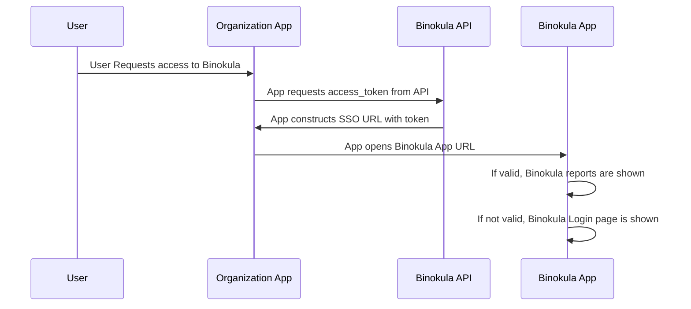

# Developer Guide 

###Introduction
The Binokula API provides external applications the ability to access, edit or add objects related to the Binokula application. Current end-points focus on user management and access to reports. All API calls are secured with SSL, tenant names and API Keys (client_secret). If you need access to your client_secret, please contact <support@binokula.app>.

###Single-Sign On
####Overview
Single-Sign On (SSO) enables external applications to give users access to Binokula without the need for them to enter their Binokula password. Access to Binokula is gained with the combination of a user's email address and a securely generated access token. The access token is valid for one hour and can be refreshed using the API. Binokula will check if the users email is registered as a system user and if the access token is valid before granting access to the application. If authentication fails, a redirect to the Binokula login page will be executed. Only one user token can be active at any given time.




####Endpoints
#####Issue/Renew User Access Token
**URL:** <https://api.binokula.app/api/Token>

**HTTP Verb:** GET

**Headers:**

* client_secret

**Parameters:**

* email
* tenant
* existingusersonly - optional detault set to "false". When "true" a valid token is only generated for existing users. Can be used to stop users from being auto-created.
* code
    * This is a function key provided to the customer to access this endpoint
Response:

Status: 200 OK
```json
{
    "email": "example@example.com",
    "access_token": "FbyIcycqczD6sT519Clgo2iNoW3wxXupT2uxRbUrGO8=",
    "expiry_date": "2018-04-26T03:08:03.893495+00:00"
}
```

#####(Redirect to) Binokula External Access
**URL:** <https://binokula.app/Account/ExternalAccess>

**Parameters:**

* email
* access_token
* tenant

**Response:**

* Status: 200 OK
* Redirects to users Binokula homepage

**Note:** Credentials are URL encoded

###User Management
####Overview
The User Management API enables external applications to register, delete, enable or disable users to their Binokula tenant. This register endpoint creates a user with an email and generates a secure password for the newly created user. The password is not known to the external application nor the registered user. To access this endpoint the external application must supply the API a valid client secret key along with tenant name.

####Endpoints
#####Register User
**URL:** <https://api.binokula.app/api/User>

**HTTP Verb:** PUT

**Headers:**

* client_secret

**Parameters:**

* email
* tenant
* code
    * This is a function key provided to the customer to access this endpoint

**Response:**

* Status: 200 OK

```json
{
    "message": "\"Successfully registered example@example.com\""
}
```

#####Delete User
**URL:** <https://api.binokula.app/api/User>

**HTTP Verb:** Delete

**Headers:**

* client_secret

**Parameters:**

* email
* tenant
* code
    * This is a function key provided to the customer to access this endpoint

**Response:**

* Status: 200 OK

```json
{
    "message": "\"Successfully removed example@example.com\""
}
```

#####Enable/Disable User
**URL:** <https://api.binokula.app/api/UserStatus>

**HTTP Verb:** Post

**Headers:**

* client_secret

**Parameters:**

* email
* tenant
* status ("true" - enables user/"false" - disables user)
* code
    * This is a function key provided to the customer to access this endpoint

**Response:**

* Status: 200 OK

```json
{
    "message": "\"User Status set to true/false\""
}
```