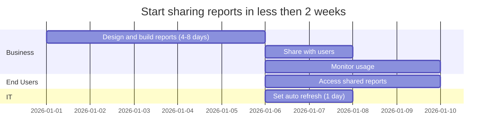
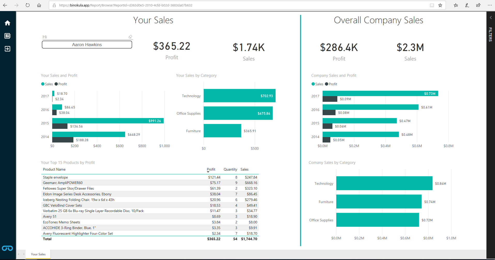
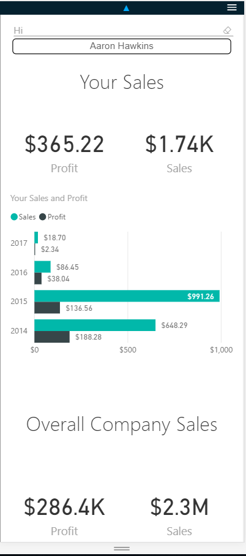

# Binokula 

**Get beautiful, interactive reports to your business affiliates securely, easily and quickly.**


> Binokula has simplified the process of report sharing to the point where the hardest part now becomes deciding whether you want to show a bar graph or pie chart in your report. 

###What is Binokula?
Binokula is a report sharing website which provides an organization with the power to *securely share reports* with their business affiliates. Affiliates could be customers, suppliers, subsidiaries, dealers, franchisees, brokers, agents, frontline workers, business associates or partners.

Binokula attempts to address most of the common problems associated with secure report sharing. With Binokula you will be able to:

* *Easily* expose secure, interactive reports created with Microsoft Power BI.
* Seamlessly integrate Binokula with your existing portal.
* Restrict users' access to only their reports and data.
* Scale up to thousands of users, if required.
* Track when users access their reports.
* *Quickly* publish new reports or change existing reports, all without needing a software developer.
* Automate the entire process, while knowing that Binokula constantly monitors the platform for you.

###What does Binokula look like?
See for yourself by selecting one of the demo users on the [Binokula demo site](https://binokula.app/demo/index)



Reports can also be configured for mobile viewing.




###How does Binokula work?

Binokula provides a set of services based around Microsoft Power BI. It allows you to publish and share reports built in Power BI through a centralized website. Each user will manage their own login on Binokula or you give them access through the Single-Sign-On API. Binokula ensures users can only see reports assigned to them and automatically enforces row-level security (RLS) to each report. 

> Binokula licensing is by active users instead of named. Users don't need to be integrated with Azure Active Directory, don't require a Microsoft Account and don't need a Power BI Pro license.

**Step 1: Use Power BI to:**
 
 * Connect, prepare, model and schedule data loads
 * Apply row-level data security
 * Build reports and mobile views you wish to share

**Step 2: You use Binokula to**
 
 * Provide a portal for users to access their reports
 * Provide mobile views of reports
 * Secure access to specific reports
 * Provide single-sign-on for users from your existing website to their reports
 * Know that Power BI row-level security is enforced
 * Add, delete or disable users
 * View real-time and historical report usage

 > Most of Binokula's existing customers use Power BI for their internal business analytics but came to Binokula to for external report sharing. A pure Power BI report sharing option would have placed unwanted constraints on users like having named Power BI Pro Licenses or Azure Active Directory accounts or having a Microsoft account. Binokula simplifies the report sharing landscape while leveraging the report delivery capabilities of Power BI.

###How is Binokula different to other report sharing tools?

Binokula has been created specifically with secure report sharing in mind. The aim is to make it as simple and easy as possible for report builders, administrators and end users.

**Easy for Report Builders** - Microsoft Power BI has become one of the dominant players in the self-service data preparation and visualization market. Instead of creating our own bespoke visualization framework, we want to enable anybody who is familiar with Power BI to hosts reports on the Binokula platform. Power BI also takes care of data-preparation, scheduling, storage and presentation - which means you don't have to add additional tools or infrastructure to your environment.

You don't have to worry about mixing Binokula content with any existing Power BI content you might have - we create a separate Power BI tenant for you that is dedicated only to Binokula. This also ensures nobody else can access your data.

Any change on a Power BI report is immediately reflected when users access the report in Binokula.

Binokula even integrates with the mobile layout configuration of Power BI, which means you can create mobile views of your reports without much effort at all.


**Easy for Administrators** - After publishing a Power BI Report, you would want your users to access their reports. This is easily managed within the Binokula application and is as simple as:

 1. Creating a report group
 + Assigning the report to the report group
 + Assigning users to the report groups
 + Sending an invitation to users

This process makes it easy to provide access to only the reports that you wish users to see, allowing you to create different views for different audiences. As an administrator, you will also have real-time access to the report usage metrics on Binokula. Users can also be auto-disabled if they haven't logged in after a certain number of days. You can even direct a user back to your own website if they log out of Binokula.

**Easy for End Users** - As an end user you will be able to access Binokula with your email and password OR have single-sign-on experience from an existing portal. You also don't need to associate your email with any other authentication service.
```mermaid  
    graph TB
        A0[User opens browser]
        A0-->A1[User logs on to Binokula]
        A0-->A2[User logs on to your website]
        A2-->|Your website uses Binokula SSO|A1
    end
```
Once you access Binokula you will either be:

 1. Taken directly to your report (if you have only one report assigned) OR
 + Taken to your default report (if you saved a default report) OR
 + Taken to the list of reports you can have access to.

 Reports are read-only but fully interactive and you will only see the data you are meant to. There are no additional buttons, menus or confusing user interfaces.

###Who uses Binokula?

 Binokula is used by organizations that:

 * Need to securely share reports with users who are affiliated with their organization.
 * Need to provide an interactive experience for users instead of emailing static PDF documents.
 * Need to empower business users to control report sharing.
 * Need to avoid a large and complex IT projects.
 * Need to avoid licensing per named user.
 * Need to be up and running as soon as possible.
 * Need to provide a easy and simple experience for end users.
